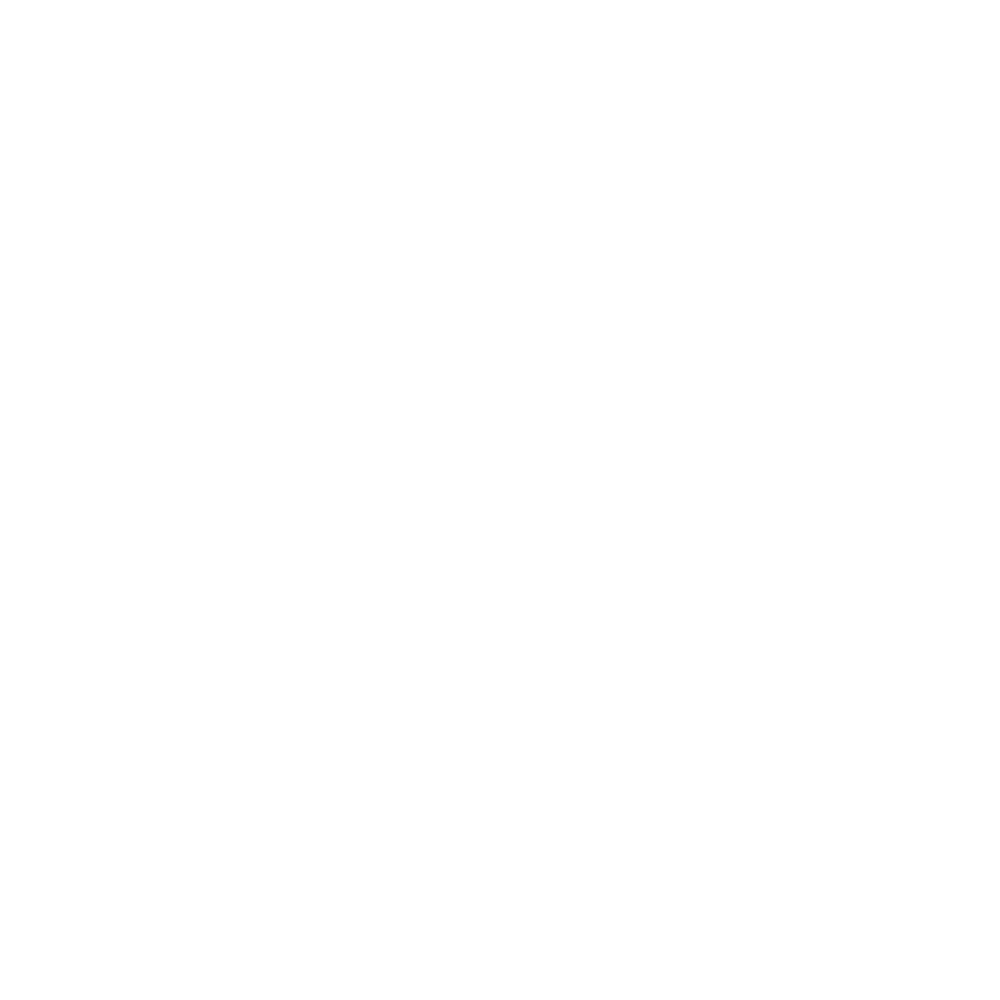

<!-- Improved compatibility of Voltar ao topo link: See: https://github.com/othneildrew/Best-README-Template/pull/73 -->
<a name="readme-top"></a>
<!--
*** Thanks for checking out the Best-README-Template. If you have a suggestion
*** that would make this better, please fork the repo and create a pull request
*** or simply open an issue with the tag "enhancement".
*** Don't forget to give the project a star!
*** Thanks again! Now go create something AMAZING! :D
-->

<!-- PROJECT SHIELDS -->
<!--
*** I'm using markdown "reference style" links for readability.
*** Reference links are enclosed in brackets [ ] instead of parentheses ( ).
*** See the bottom of this document for the declaration of the reference variables
*** for contributors-url, forks-url, etc. This is an optional, concise syntax you may use.
*** https://www.markdownguide.org/basic-syntax/#reference-style-links
-->

<!-- PROJECT LOGO -->
<br />
<div align="center">
  <a href="https://github.com/thalysonluiz/nearby">
    
  </a>

  <h3 align="center">Nearby</h3>

  <p align="center">
    Projeto desenvolvido no NLW Pocket Mobile em React Native para um clube de benefícios de estabelecimentos
    <br />
    <br />
    <a href="https://github.com/thalysonluiz/nearby/issues/new?labels=bug&template=bug-report---.md">Report Bug</a>
    ·
    <a href="https://github.com/thalysonluiz/nearby/issues/new?labels=enhancement&template=feature-request---.md">Request Feature</a>
  </p>
</div>

<p align="center">
  
  
  
  
  
  
</p>

<!-- TABLE OF CONTENTS -->
### Sumário

  <ol>
    <li>
      <a href="#about-the-project">About The Project</a>
      <ul>
        <li><a href="#built-with">Built With</a></li>
      </ul>
    </li>
    <li>
      <a href="#getting-started">Getting Started</a>
      <ul>
        <li><a href="#prerequisites">Prerequisites</a></li>
        <li><a href="#installation">Installation</a></li>
      </ul>
    </li>
    <li><a href="#usage">Usage</a></li>
    <li><a href="#roadmap">Roadmap</a></li>
    <li><a href="#contributing">Contributing</a></li>
    <li><a href="#license">License</a></li>
    <li><a href="#contact">Contact</a></li>
    <li><a href="#acknowledgments">Acknowledgments</a></li>
  </ol>
<br>

<!-- ABOUT THE PROJECT -->
## Descrição do Projeto

[![Thumbnail][product-screenshot]](https://example.com)

Aplicativo de benefícios em estabelecimentos, apresenta um mapa com os estabelecimentos filtrados por tipo. Ao escolher o estabelecimento usa a câmera para ler o QrCode e resgatar o cupom de desconto.

<p align="right">(<a href="#readme-top">Voltar ao topo</a>)</p>

<!--https://github.com/simple-icons/simple-icons/blob/master/slugs.md-->
### 🛠 Tecnologias Utilizadas

* &nbsp;
* &nbsp;
* &nbsp;
* &nbsp;

<p align="right">(<a href="#readme-top">Voltar ao topo</a>)</p>

<!-- GETTING STARTED -->
## Começando

Exemplo para executar o projeto local.
Começar com repositório local e seguir os passos a seguir.

### Pré-requisitos

É necessário ter o node instalado

### Instalação

1. Clone o repositório

   ```sh
   git clone https://github.com/thalysonluiz/nearby.git
   ```

2. Instalar os pacotes NPM

   ```sh
   npm install
   ```

4. Rodar a aplicação

   ```js
   npx expo start
   ```

<p align="right">(<a href="#readme-top">Voltar ao topo</a>)</p>

<!-- USAGE EXAMPLES -->

<!-- ROADMAP -->

<!-- CONTRIBUTING --
## Contributing

Contributions are what make the open source community such an amazing place to learn, inspire, and create. Any contributions you make are **greatly appreciated**.

If you have a suggestion that would make this better, please fork the repo and create a pull request. You can also simply open an issue with the tag "enhancement".
Don't forget to give the project a star! Thanks again!

1. Fork the Project
2. Create your Feature Branch (`git checkout -b feature/AmazingFeature`)
3. Commit your Changes (`git commit -m 'Add some AmazingFeature'`)
4. Push to the Branch (`git push origin feature/AmazingFeature`)
5. Open a Pull Request

<p align="right">(<a href="#readme-top">Voltar ao topo</a>)</p>

<!-- LICENSE -->
## License

Distributed under the MIT License. See `LICENSE.txt` for more information.

<p align="right">(<a href="#readme-top">Voltar ao topo</a>)</p>

<!-- CONTACT -->
## Autor

<div style="display: flex;">
<p style="display: flex; flex-direction: column; justify-content: center; align-items: center">
 
 <br />
 <sub><b>Thalyson Luiz</b></sub>
</p>
</div>

<p align="right">(<a href="#readme-top">Voltar ao topo</a>)</p>

## 👨🏽‍🦲 &nbsp;Social Links

<!--<p align="left" style="background:yellow">
<a href="https://codepen.io/maykbrito" target="_blank">
  
</a>
<a href="https://twitter.com/maykbrito" target="_blank">
    
</a>
<a href="https://linkedin.com/in/maykbrito" target="_blank">
  
</a>
<a href="https://instagram.com/maykbrito" target="_blank">
 
</a>
<a href="https://youtube.com/maykbrito" target="_blank">
 
</a>
</p>-->

<!-- MARKDOWN LINKS & IMAGES -->
<!-- https://www.markdownguide.org/basic-syntax/#reference-style-links -->
[product-screenshot]: images/Thumbnail.png
